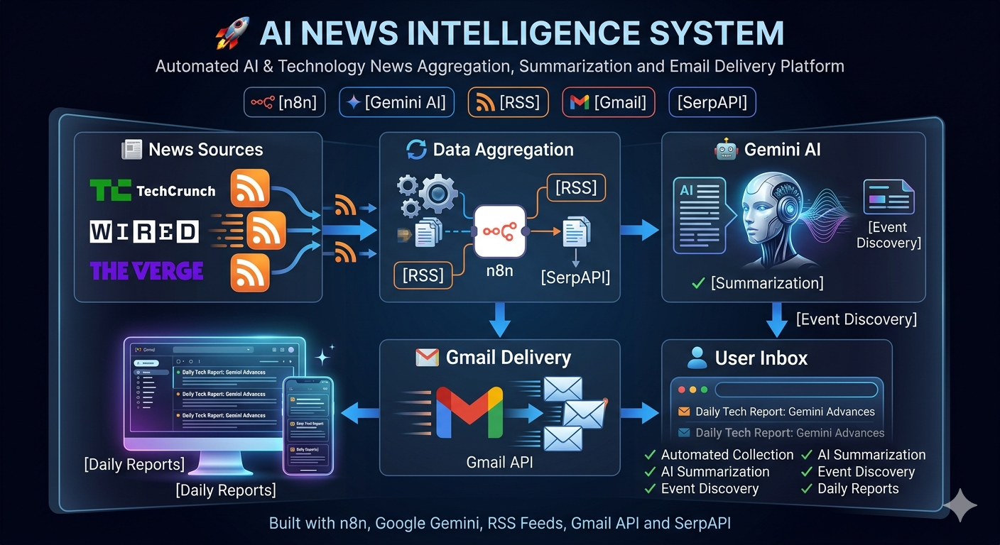
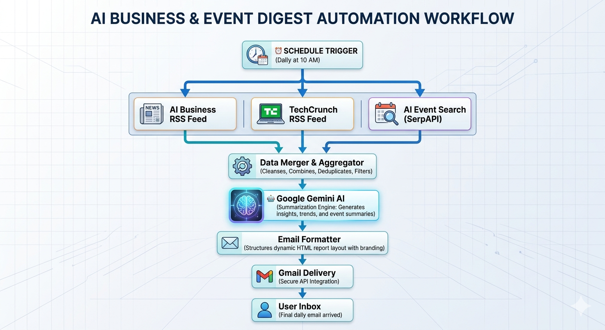
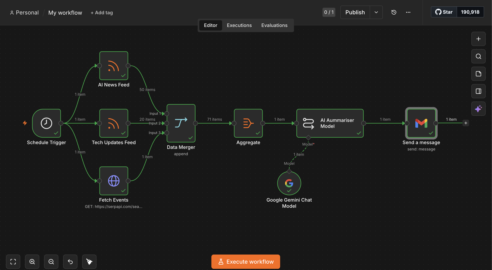
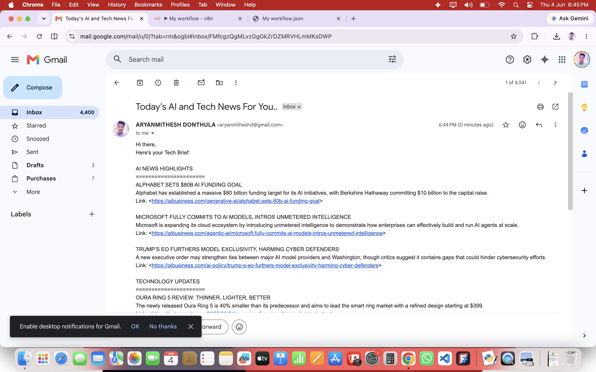

# 🚀 AI News Intelligence System

<p align="center">
  
</p>

<p align="center">
  
  
  
  
</p>

---

## 📖 Overview

AI News Intelligence System is an end-to-end workflow automation platform that automatically collects AI and technology news from multiple sources, discovers upcoming industry events, generates concise summaries using Google Gemini AI, and delivers structured daily intelligence reports directly to the user's inbox.

The system eliminates the need to manually browse multiple websites and newsletters by creating a single personalized daily briefing.

---

## 🎯 Problem Statement

Technology professionals often spend significant time tracking AI breakthroughs, technology updates, and industry events across numerous websites and news platforms.

This project automates the entire process by:

* Collecting news from trusted sources
* Aggregating and filtering content
* Generating AI-powered summaries
* Delivering daily email reports automatically

---

## 🏗️ System Architecture

<p align="center">
  
</p>

### Workflow Pipeline

Schedule Trigger → RSS Feeds & Event Sources → Data Aggregation → Google Gemini AI → Email Generation → Gmail Delivery

---

## 🔄 Workflow Overview

<p align="center">
  
</p>

---

## ✨ Key Features

### 📰 Multi-Source News Collection

* AI Business RSS Feed
* TechCrunch RSS Feed
* Event Discovery via SerpAPI

### 🤖 AI-Powered Summarization

* Google Gemini AI integration
* Intelligent content summarization
* Structured daily reports

### 📅 Event Discovery

* Finds relevant AI and technology events
* Includes upcoming conferences and industry activities

### 📧 Automated Delivery

* Gmail integration
* Daily scheduled execution
* Zero manual effort required

### ⚡ Workflow Automation

* Fully automated using n8n
* Scheduled execution
* Scalable workflow architecture

---

## 📬 Sample Email Output

<p align="center">
  
</p>

---

## 🛠️ Technology Stack

| Category                | Technology    |
| ----------------------- | ------------- |
| Workflow Automation     | n8n           |
| Artificial Intelligence | Google Gemini |
| Email Service           | Gmail API     |
| News Sources            | RSS Feeds     |
| Event Discovery         | SerpAPI       |
| Integration             | REST APIs     |

---

## 📂 Repository Structure

```text
AI-News-Intelligence-System
│
├── assets/
│   └── banner.png
│
├── docs/
│   ├── architecture-diagram.png
│   ├── workflow-overview.png
│   ├── email-output.png
│   └── execution-success.png
│
├── workflow/
│   └── ai-news-intelligence-system.json
│
├── README.md
└── LICENSE
```

---

## 🚀 Getting Started

### Prerequisites

* n8n
* Google Gemini API Key
* Gmail Account
* SerpAPI Key

### Installation

1. Clone the repository

```bash
git clone https://github.com/Aryanmithesh07/AI-News-Intelligence-System.git
```

2. Open n8n

3. Import:

```text
workflow/ai-news-intelligence-system.json
```

4. Configure credentials:

   * Google Gemini API
   * Gmail OAuth
   * SerpAPI

5. Activate workflow

6. Enjoy automated daily AI briefings

---

## 🔮 Future Roadmap

* Telegram Integration
* Slack Notifications
* Personalized Categories
* Sentiment Analysis
* Web Dashboard
* Analytics Reporting

---

## 📈 Learning Outcomes

Through this project I gained hands-on experience with:

* Workflow Automation
* Prompt Engineering
* API Integration
* AI Application Development
* Email Automation
* No-Code/Low-Code Development
* System Design

---

## 👨‍💻 Maintainer

**Aryan Mithesh**
Computer Science & Engineering Undergraduate, IIITDM Kurnool

Passionate about building intelligent software systems, workflow automation solutions, and AI-powered applications. Focused on combining software engineering principles with modern AI technologies to create scalable and impactful real-world products.

### Connect With Me

* GitHub: https://github.com/Aryanmithesh07
* LinkedIn: https://linkedin.com/in/aryanmitheshdonthula

### Areas of Interest

* Artificial Intelligence & LLM Applications
* Workflow Automation & Agentic Systems
* Software Engineering
* Full-Stack Development
* Compiler Design
* Cloud & API Integrations

---

*Open to collaboration, internship opportunities, and discussions around AI, automation, and software engineering.*

---

⭐ If you found this project interesting, consider giving it a star.
